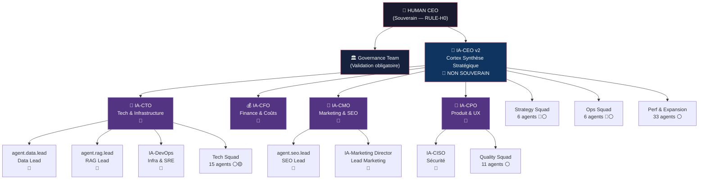
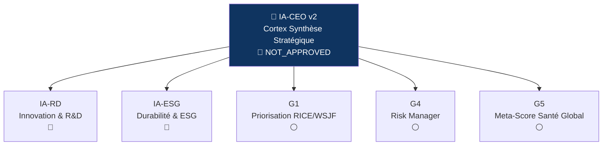
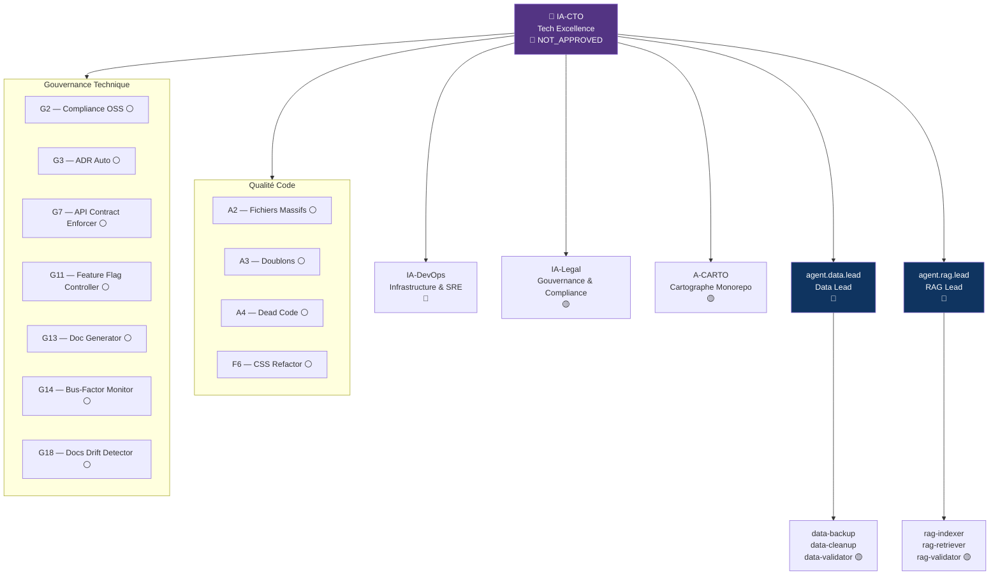
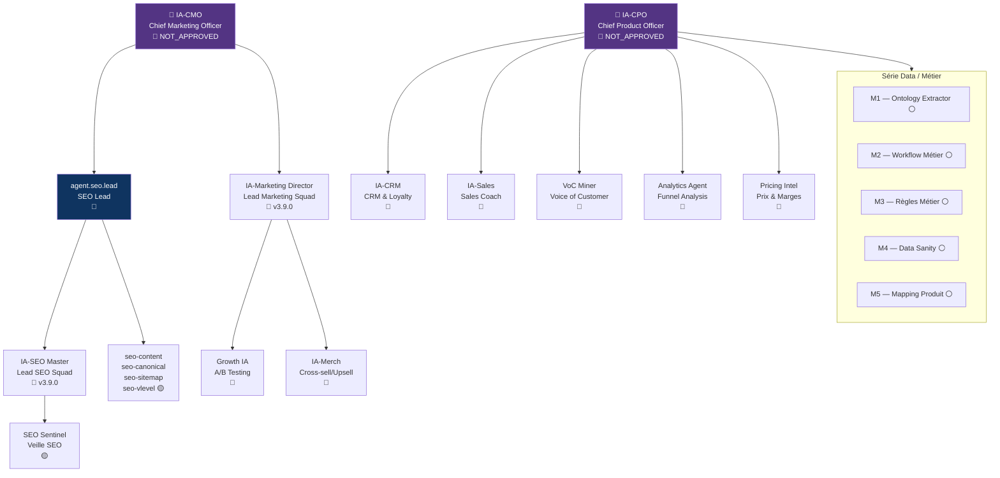
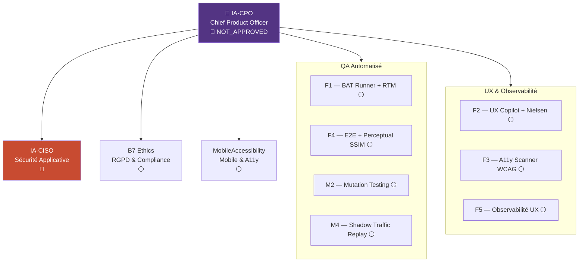
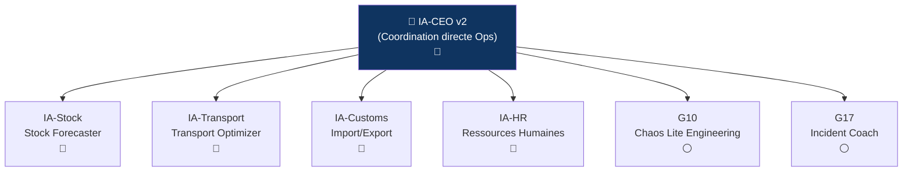
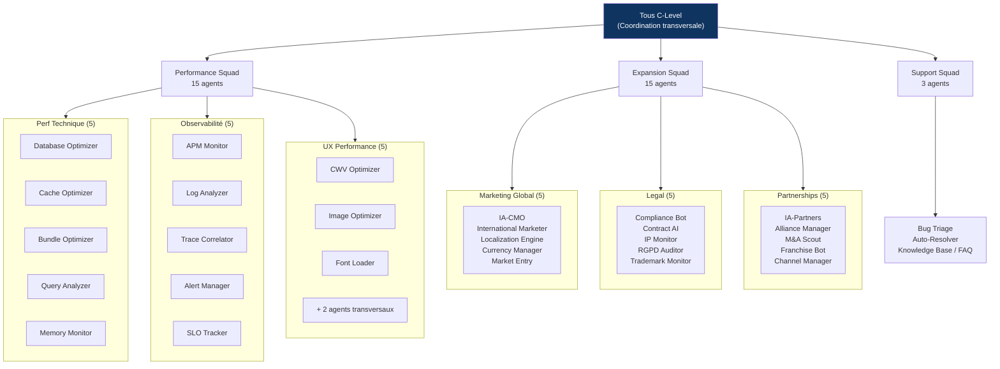

# Organigramme Automecanik — AI-COS

> Version : 1.0.0 | Date : 2026-03-08 | Source de vérité : REG-001 v2.1.0

**Automecanik** est une compagnie AI-native. Chaque domaine métier dispose d'agents IA
organisés sous supervision humaine non-négociable (RULE-H0).

## Légende des statuts

| Symbole | Statut REG-001 | Signification |
|---------|---------------|---------------|
| 🟢 | APPROVED | Opérationnel |
| 🟡 | APPROVED_WITH_CONDITIONS | Activable sous conditions Airlock |
| 🔴 | NOT_APPROVED | Planifié — approbation humaine requise |
| ⚪ | Conceptuel | Défini, pas encore soumis à REG-001 |

---

## Vue 1 — Hiérarchie Globale

---

## Vue 2 — Par Domaine Métier

---

### Domaine 1 — Stratégie & Pilotage

> **Squad** : Strategy Squad | **Budget** : €193K | **ROI** : +€330K/an

| Agent | Rôle | Statut | Budget | Squad |
|-------|------|--------|--------|-------|
| IA-CEO v2 | Cortex Synthèse Stratégique | 🔴 NOT_APPROVED | €85K | Strategy |
| IA-RD | Innovation & R&D | 🔴 NOT_APPROVED | €30K | Strategy |
| IA-ESG | Durabilité & ESG | 🔴 NOT_APPROVED | €25K | Strategy |
| G1 | Priorisation RICE/WSJF/CoD | ⚪ Conceptuel | €15K | Strategy |
| G4 | Risk Manager | ⚪ Conceptuel | €20K | Strategy |
| G5 | Meta-Score Santé Global | ⚪ Conceptuel | €18K | Strategy |

---

### Domaine 2 — Excellence Technique & Infrastructure

> **Squad** : Tech Squad | **Budget** : €261K | **ROI** : +€2,024K/an

| Agent | Rôle | Statut | Budget | Squad |
|-------|------|--------|--------|-------|
| IA-CTO | Tech Excellence | 🔴 NOT_APPROVED | €35K | Tech |
| IA-DevOps | Infrastructure & SRE | 🔴 NOT_APPROVED | €45K | Tech |
| IA-Legal | Gouvernance & Compliance | 🟡 APPROVED_WITH_CONDITIONS | €12K | Tech |
| A-CARTO | Cartographe Monorepo | 🟡 APPROVED_WITH_CONDITIONS | €48K | Tech |
| agent.data.lead | Data Lead | 🔴 NOT_APPROVED | — | Governance |
| agent.rag.lead | RAG Lead | 🔴 NOT_APPROVED | — | Governance |
| IA-Diag | Knowledge Graph Diagnostic | 🟡 APPROVED_WITH_CONDITIONS | €25K | Tech |
| A2 | Chasseur Fichiers Massifs | ⚪ Conceptuel | €12K | Tech |
| A3 | Détecteur Doublons | ⚪ Conceptuel | €15K | Tech |
| A4 | Détecteur Dead Code | ⚪ Conceptuel | €10K | Tech |
| F6 | CSS Refactor | ⚪ Conceptuel | €12K | Tech |
| G2 | Compliance OSS | ⚪ Conceptuel | €12K | Tech |
| G3 | ADR Auto | ⚪ Conceptuel | €10K | Tech |
| G7 | API Contract Enforcer | ⚪ Conceptuel | €8K | Tech |
| G11 | Feature Flag Controller | ⚪ Conceptuel | €4K | Tech |
| G13 | Doc Generator | ⚪ Conceptuel | €6K | Tech |
| G14 | Bus-Factor Monitor | ⚪ Conceptuel | €3K | Tech |
| G18 | Docs Drift Detector | ⚪ Conceptuel | €4K | Tech |

---

### Domaine 3 — Commerce, SEO & Marketing

> **Squad** : Business Squad | **Budget** : €207K | **ROI** : +€835K/an

| Agent | Rôle | Statut | Budget | Squad |
|-------|------|--------|--------|-------|
| IA-CMO | Chief Marketing Officer | 🔴 NOT_APPROVED | — | Governance |
| agent.seo.lead | SEO Lead | 🔴 NOT_APPROVED | — | Governance |
| IA-SEO Master | Lead SEO Squad | 🔴 NOT_APPROVED | €25K | Business |
| SEO Sentinel | Veille SEO concurrentielle | 🟡 APPROVED_WITH_CONDITIONS | €15K | Business |
| IA-Marketing Director | Lead Marketing Squad | 🔴 NOT_APPROVED | €30K | Business |
| Growth IA | A/B Testing & Growth | 🔴 NOT_APPROVED | €18K | Business |
| IA-CRM | CRM & Loyalty | 🔴 NOT_APPROVED | €22K | Business |
| IA-Sales | Sales Coach | 🔴 NOT_APPROVED | €20K | Business |
| IA-Merch | Cross-sell/Upsell | 🔴 NOT_APPROVED | €15K | Business |
| VoC Miner | Voice of Customer | 🔴 NOT_APPROVED | €12K | Business |
| Analytics Agent | Funnel Analysis | 🔴 NOT_APPROVED | €18K | Business |
| Pricing Intel | Prix & Marges dynamiques | 🔴 NOT_APPROVED | €20K | Business |
| M1 | Ontology Extractor | ⚪ Conceptuel | €15K | Business |
| M2 | Workflow Métier | ⚪ Conceptuel | €12K | Business |
| M3 | Règles Métier | ⚪ Conceptuel | €10K | Business |
| M4 | Data Sanity | ⚪ Conceptuel | €18K | Business |
| M5 | Mapping Produit ↔ Données | ⚪ Conceptuel | €12K | Business |

---

### Domaine 4 — Qualité, Sécurité & UX

> **Squad** : Quality Squad | **Budget** : €184K | **ROI** : +€630K/an

| Agent | Rôle | Statut | Budget | Squad |
|-------|------|--------|--------|-------|
| IA-CPO | Produit & UX | 🔴 NOT_APPROVED | €35K | Quality |
| IA-CISO | Sécurité Applicative | 🔴 NOT_APPROVED | €40K | Quality |
| B7 Ethics | RGPD & Compliance | ⚪ Conceptuel | €6K | Quality |
| MobileAccessibility | Mobile & A11y | ⚪ Conceptuel | €12K | Quality |
| F1 | BAT Runner + RTM | ⚪ Conceptuel | €18K | Quality |
| F2 | UX Copilot + Nielsen | ⚪ Conceptuel | €15K | Quality |
| F3 | A11y Scanner WCAG | ⚪ Conceptuel | €12K | Quality |
| F4 | E2E + Perceptual SSIM | ⚪ Conceptuel | €20K | Quality |
| F5 | Observabilité UX | ⚪ Conceptuel | €15K | Quality |
| M2 | Mutation Testing | ⚪ Conceptuel | €4K | Quality |
| M4 | Shadow Traffic Replay | ⚪ Conceptuel | €5K | Quality |

---

### Domaine 5 — Opérations & Logistique

> **Squad** : Ops Squad | **Budget** : €128K | **ROI** : +€460K/an

| Agent | Rôle | Statut | Budget | Squad |
|-------|------|--------|--------|-------|
| IA-Stock | Stock Forecaster | 🔴 NOT_APPROVED | €35K | Ops |
| IA-Transport | Transport Optimizer | 🔴 NOT_APPROVED | €30K | Ops |
| IA-Customs | Import/Export | 🔴 NOT_APPROVED | €25K | Ops |
| IA-HR | Ressources Humaines | 🔴 NOT_APPROVED | €28K | Ops |
| G10 | Chaos Lite Engineering | ⚪ Conceptuel | €5K | Ops |
| G17 | Incident Coach | ⚪ Conceptuel | €5K | Ops |

---

### Domaine 6 — Performance & Expansion (Transversal)

> **Squads** : Performance (15) + Expansion (15) + Support (3) | **Budget** : €107K | **ROI** : +€560K/an

---

## Vue 3 — Table de Synthèse Globale

### Tous les agents — triés par domaine

| Domaine | Agent | Rôle | Statut | Budget | Squad |
|---------|-------|------|--------|--------|-------|
| **Stratégie** | IA-CEO v2 | Cortex Synthèse Stratégique | 🔴 | €85K | Strategy |
| **Stratégie** | IA-RD | Innovation & R&D | 🔴 | €30K | Strategy |
| **Stratégie** | IA-ESG | Durabilité & ESG | 🔴 | €25K | Strategy |
| **Stratégie** | G1 | Priorisation RICE/WSJF | ⚪ | €15K | Strategy |
| **Stratégie** | G4 | Risk Manager | ⚪ | €20K | Strategy |
| **Stratégie** | G5 | Meta-Score Santé Global | ⚪ | €18K | Strategy |
| **Tech** | IA-CTO | Tech Excellence | 🔴 | €35K | Tech |
| **Tech** | IA-DevOps | Infrastructure & SRE | 🔴 | €45K | Tech |
| **Tech** | IA-Legal | Gouvernance & Compliance | 🟡 | €12K | Tech |
| **Tech** | A-CARTO | Cartographe Monorepo | 🟡 | €48K | Tech |
| **Tech** | IA-Diag | Knowledge Graph Diagnostic | 🟡 | €25K | Tech |
| **Tech** | A2 | Chasseur Fichiers Massifs | ⚪ | €12K | Tech |
| **Tech** | A3 | Détecteur Doublons | ⚪ | €15K | Tech |
| **Tech** | A4 | Détecteur Dead Code | ⚪ | €10K | Tech |
| **Tech** | F6 | CSS Refactor | ⚪ | €12K | Tech |
| **Tech** | G2 | Compliance OSS | ⚪ | €12K | Tech |
| **Tech** | G3 | ADR Auto | ⚪ | €10K | Tech |
| **Tech** | G7 | API Contract Enforcer | ⚪ | €8K | Tech |
| **Tech** | G11 | Feature Flag Controller | ⚪ | €4K | Tech |
| **Tech** | G13 | Doc Generator | ⚪ | €6K | Tech |
| **Tech** | G14 | Bus-Factor Monitor | ⚪ | €3K | Tech |
| **Tech** | G18 | Docs Drift Detector | ⚪ | €4K | Tech |
| **Commerce** | IA-SEO Master | Lead SEO Squad | 🔴 | €25K | Business |
| **Commerce** | SEO Sentinel | Veille SEO | 🟡 | €15K | Business |
| **Commerce** | IA-Marketing Director | Lead Marketing | 🔴 | €30K | Business |
| **Commerce** | Growth IA | A/B Testing & Growth | 🔴 | €18K | Business |
| **Commerce** | IA-CRM | CRM & Loyalty | 🔴 | €22K | Business |
| **Commerce** | IA-Sales | Sales Coach | 🔴 | €20K | Business |
| **Commerce** | IA-Merch | Cross-sell/Upsell | 🔴 | €15K | Business |
| **Commerce** | VoC Miner | Voice of Customer | 🔴 | €12K | Business |
| **Commerce** | Analytics Agent | Funnel Analysis | 🔴 | €18K | Business |
| **Commerce** | Pricing Intel | Prix & Marges | 🔴 | €20K | Business |
| **Commerce** | M1 | Ontology Extractor | ⚪ | €15K | Business |
| **Commerce** | M2 | Workflow Métier | ⚪ | €12K | Business |
| **Commerce** | M3 | Règles Métier | ⚪ | €10K | Business |
| **Commerce** | M4 | Data Sanity | ⚪ | €18K | Business |
| **Commerce** | M5 | Mapping Produit | ⚪ | €12K | Business |
| **Qualité** | IA-CPO | Produit & UX | 🔴 | €35K | Quality |
| **Qualité** | IA-CISO | Sécurité Applicative | 🔴 | €40K | Quality |
| **Qualité** | B7 Ethics | RGPD & Compliance | ⚪ | €6K | Quality |
| **Qualité** | MobileAccessibility | Mobile & A11y | ⚪ | €12K | Quality |
| **Qualité** | F1 | BAT Runner + RTM | ⚪ | €18K | Quality |
| **Qualité** | F2 | UX Copilot + Nielsen | ⚪ | €15K | Quality |
| **Qualité** | F3 | A11y Scanner WCAG | ⚪ | €12K | Quality |
| **Qualité** | F4 | E2E + Perceptual SSIM | ⚪ | €20K | Quality |
| **Qualité** | F5 | Observabilité UX | ⚪ | €15K | Quality |
| **Qualité** | M2 | Mutation Testing | ⚪ | €4K | Quality |
| **Qualité** | M4 | Shadow Traffic Replay | ⚪ | €5K | Quality |
| **Ops** | IA-Stock | Stock Forecaster | 🔴 | €35K | Ops |
| **Ops** | IA-Transport | Transport Optimizer | 🔴 | €30K | Ops |
| **Ops** | IA-Customs | Import/Export | 🔴 | €25K | Ops |
| **Ops** | IA-HR | Ressources Humaines | 🔴 | €28K | Ops |
| **Ops** | G10 | Chaos Lite Engineering | ⚪ | €5K | Ops |
| **Ops** | G17 | Incident Coach | ⚪ | €5K | Ops |
| **Perf/Expansion** | Performance Squad | 15 agents tech/observ/UX | ⚪ | €45K | Perf |
| **Perf/Expansion** | Expansion Squad | 15 agents intl/legal/partners | ⚪ | €52K | Expansion |
| **Perf/Expansion** | Support Squad | 3 agents auto-fix/docs | ⚪ | €10K | Support |

**Total Squads : 88 agents | Budget : €1,080K | ROI : +€4,839K/an (448%)**

---

## Notes Architecturales

### Squad vs Domaine — Deux vues complémentaires

| Vue | Fichier source | Usage |
|-----|---------------|-------|
| **Vue Squad** (budget/planning) | `nestjs-remix-monorepo/.spec/workflows/` | Planification, ROI, budget |
| **Vue Fonctionnelle** (hiérarchie) | `governance-vault/05-agents/ai-cos/` | Reporting, activation, governance |
| **Vue Registre** (statuts officiels) | `governance-vault/05-agents/registry/REG-001-agents.md` | Compliance, approbation |

### Phase d'activation (ADR-009 v2.0, ADR-011)

1. **Phase A — COMPLÈTE** ✅ : Fiches agents mises à jour (Claude CLI remplace OpenClaw)
2. **Phase B — EN COURS** : Activation des 16 agents APPROVED_WITH_CONDITIONS via Airlock
3. **Phase C — PLANIFIÉE** : Activation C-Level (IA-CEO, IA-CTO, etc.) — approbation humaine requise

### Agents Governance-Vault (hors Squads)

Ces agents existent dans `governance-vault/05-agents/ai-cos/` mais ne sont pas comptés
dans les 88 squads (ils constituent la couche de coordination C-Level + leads) :

| Agent | Fiche | Statut |
|-------|-------|--------|
| agent.ceo.ia | AGENT-agent-ceo-ia.md | 🔴 NOT_APPROVED |
| agent.cfo.ia | AGENT-agent-cfo-ia.md | 🔴 NOT_APPROVED |
| agent.cmo.ia | AGENT-agent-cmo-ia.md | 🔴 NOT_APPROVED |
| agent.cpo.ia | AGENT-agent-cpo-ia.md | 🔴 NOT_APPROVED |
| agent.cto.ia | AGENT-agent-cto-ia.md | 🔴 NOT_APPROVED |
| agent.seo.lead | AGENT-agent-seo-lead.md | 🔴 NOT_APPROVED |
| agent.data.lead | AGENT-agent-data-lead.md | 🔴 NOT_APPROVED |
| agent.rag.lead | AGENT-agent-rag-lead.md | 🔴 NOT_APPROVED |
| agent.aicos.architect | AGENT-agent-aicos-architect.md | 🔴 NOT_APPROVED |
| agent.aicos.governance | AGENT-agent-aicos-governance.md | 🔴 NOT_APPROVED |

### Références

- [REG-001 v2.1.0](https://github.com/ak125/governance-vault/blob/main/05-agents/registry/REG-001-agents.md) — Registre officiel (136 agents total)
- [ADR-009 v2.0](https://github.com/ak125/governance-vault/blob/main/02-decisions/adr/ADR-009-agents-phase1-activation.md) — Règles d'activation
- [ADR-011](https://github.com/ak125/governance-vault/blob/main/02-decisions/adr/ADR-011-openclaw-claude-api-replacement.md) — Claude CLI remplace OpenClaw
- [ADR-012](https://github.com/ak125/governance-vault/blob/main/02-decisions/adr/ADR-012-aicos-vps-architecture.md) — Architecture 4 zones
- [ai-cos-index.md](https://github.com/ak125/nestjs-remix-monorepo/blob/main/.spec/workflows/ai-cos-index.md) — Index Squads & budgets
